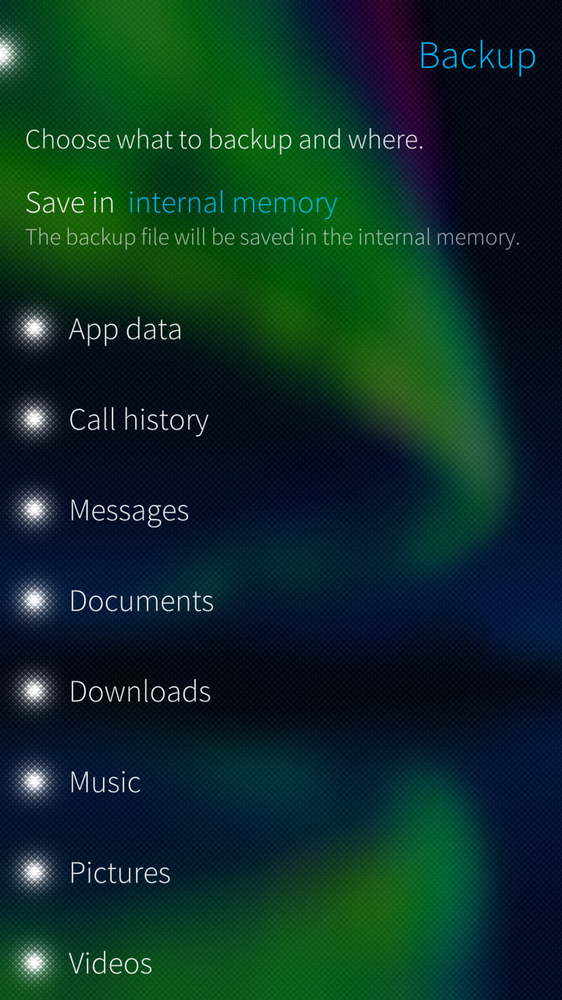

# My Data Transfer

Backup and transfer app data, documents, music, pictures and videos.

   

## Features

 

* Backup of Sailfish OS app data and files inside Documents, Music, Pictures and Videos folders.
* Restore from a save file.
* Over-the-air transfer of data and files (only with Developer mode active and ssh ppassword set).

## Translate

Languages supported:

Request a new language or contribute to existing languages on the [Transifex project page](https://www.transifex.com/fravaccaro/my-data-transfer/dashboard/).

## Builds

Builds available [here](https://openrepos.net/content/fravaccaro/my-data-transfer).

## Credits

